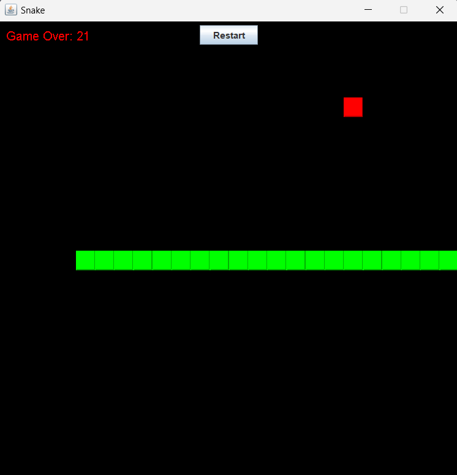

# Snake Game

This is a Snake game implemented in Java. The game features a snake that must eat food to grow while avoiding collisions with itself or the screen edges.

## How to Play

- **Controls**: Use the arrow keys (`↑`, `↓`, `←`, `→`) to control the snake's direction.
- **Objective**: Eat the food (red blocks) to grow the snake. Avoid collisions with walls or the snake itself, or you'll lose!

## Features

- **Restart the Game**: You can restart the game at any time by clicking the "Restart" button.
- **Score**: The score is displayed in the top right corner of the game. Each time the snake eats food, your score increases.

## Requirements

To run the game, you'll need to have Java installed on your system.

## Running the Game

1. Clone or download this repository to your computer.
2. Navigate to the game directory.
3. Compile the `Snakegame.java` file: `javac Snakegame.java`
4. Run the game: `java Snakegame`

## Contributing

If you find bugs or have suggestions to improve the game, feel free to open an issue or submit a pull request.

## Credits

| This game was developed by | [ Alfredo González Polo](https://github.com/AlfredoGonzalezPolo) |
| :------------------------: | --------------------------------------------------------------------------------------------------------------------------------------------------------- |

---

Have fun playing the Snake Game! 🐍✨
